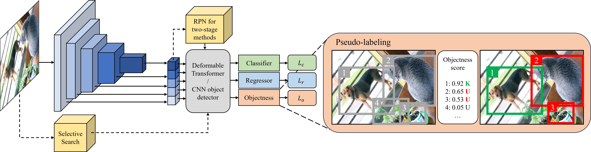
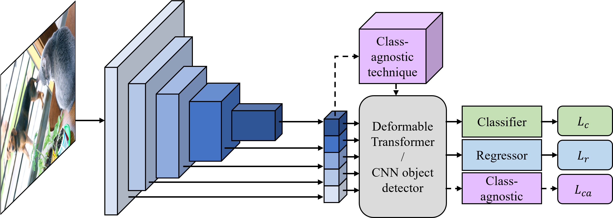
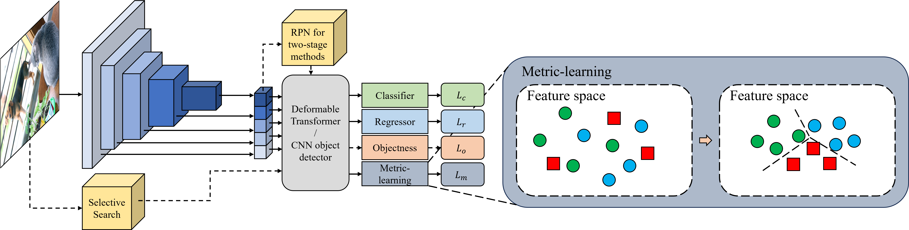
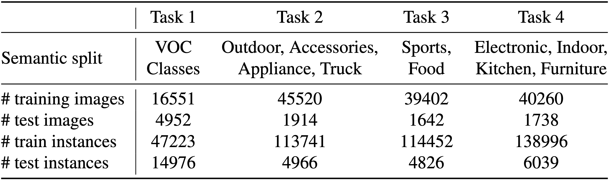
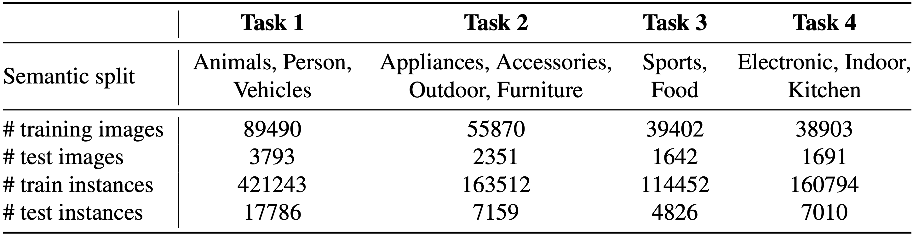

# Open World Object Detection: A Review

Welcome to the code archive for our review paper: Open World Object Detection: A Review

## Abstract:

Exploring new knowledge is a fundamental human ability that can be mirrored in the development of deep neural networks, 
especially in the field of object detection. Open world object detection (OWOD) is an emerging area of research that 
adapts this principle to explore new knowledge. It focuses on recognizing and learning from objects absent from 
initial training sets, thereby incrementally expanding its knowledge base when new class labels are introduced.

  

We conclude most existing Open World Object Detection (OWOD) methods in literature and archive their
codes in this repository covering essential aspects, including, benchmark datasets, source codes, 
evaluation results, and a taxonomy of existing methods.

# Taxonomy of OWOD methods

## Pseudo-labeling-based methods

Pseudo-labeling-based methods adopt the pseudo-labeling technique to select unknown objects during the training process.
They usually use a self-defined objectness score to measure whether the selected region contains an object or not. 
Object proposals with the top-k objectness scores and that do not match with known categories will be pseudo-labeled 
as unknown objects.

    

**Towards Open World Object Detection**

- Paper: https://openaccess.thecvf.com/content/CVPR2021/html/Joseph_Towards_Open_World_Object_Detection_CVPR_2021_paper.html
- Venue: CVPR 2021
- Code: https://github.com/JosephKJ/OWOD

**OW-DETR: Open-World Detection Transformer**

- Paper: https://openaccess.thecvf.com/content/CVPR2022/html/Gupta_OW-DETR_Open-World_Detection_Transformer_CVPR_2022_paper.html
- Venue: CVPR 2022
- Code: https://github.com/akshitac8/OW-DETR

**Fast OWDETR: transformer for open world object detection**

- Paper: https://hdl.handle.net/10356/162462
- Code: https://github.com/luckychay/Fast-OWDETR

**Open World DETR: Transformer based Open World Object Detection**

- Paper: https://arxiv.org/abs/2212.02969

**CAT: LoCalization and IdentificAtion Cascade Detection Transformer for Open-World Object Detection**

- Paper: https://openaccess.thecvf.com/content/CVPR2023/html/Ma_CAT_LoCalization_and_IdentificAtion_Cascade_Detection_Transformer_for_Open-World_Object_CVPR_2023_paper.html
- Venue: CVPR 2023
- Code: https://github.com/xiaomabufei/CAT

## Class-agnostic methods

Class-agnostic methods consider known and unknown objects as the same foreground objects. By separating the detection
of objects and the identification of each instance, these methods use a class-agnostic object proposer to measure
the objectness of proposed regions. As the class-agnostic object proposer is trained to learn the objectness 
rather than the classifier, no bias from known categories is introduced.

    

**Two-branch Objectness-centric Open World Detection**

- Paper: https://dl.acm.org/doi/abs/10.1145/3552458.3556453
- Venue: HCMA 2022

**PROB: Probabilistic Objectness for Open World Object Detection**

- Paper: https://openaccess.thecvf.com/content/CVPR2023/html/Zohar_PROB_Probabilistic_Objectness_for_Open_World_Object_Detection_CVPR_2023_paper.html
- Venue: CVPR 2023
- Code: https://github.com/orrzohar/PROB

**Addressing the Challenges of Open-World Object Detection**

- Paper: https://arxiv.org/abs/2303.14930

**Learning Open-World Object Proposals Without Learning to Classify**

- Paper: https://ieeexplore.ieee.org/abstract/document/9697381
- Venue: RA-L & ICRA 2022
- Code: https://github.com/mcahny/object_localization_network

**Random Boxes Are Open-world Object Detectors**

- Paper: https://openaccess.thecvf.com/content/ICCV2023/html/Wang_Random_Boxes_Are_Open-world_Object_Detectors_ICCV_2023_paper.html
- Venue: ICCV 2023
- Code: https://github.com/scuwyh2000/RandBox

## Metric-learning methods

Metric-learning OWOD methods generally treat the classification of unknown instances as a metic-learning process. 
By projecting the features of instances on an embedding feature space, a bunch of metric-learning techniques 
can be utilized to classify between known classes, unknown classes, and backgrounds. Most metric-learning methods
use a common strategy to extract potential unknown instances and focus on distinguishing between known, unknown, 
and backgrounds. Some methods even extend to separate different unknown classes without ground truth labels, 
which is closer to real open-world settings.

    

**Revisiting Open World Object Detection**

- Paper: https://ieeexplore.ieee.org/abstract/document/10288518
- Venue: TCSVT
- Code: https://github.com/RE-OWOD/RE-OWOD

**Open-World Object Detection via Discriminative Class Prototype Learning**

- Paper: https://arxiv.org/abs/2302.11757
- Venue: ICIP 2022

**UC-OWOD: Unknown-Classified Open World Object Detection**

- Paper: https://link.springer.com/chapter/10.1007/978-3-031-20080-9_12
- Venue: ECCV 2022
- Code: https://github.com/JohnWuzh/UC-OWOD

## Other methods

Apart from what has been included, there are also other OWOD methods that cannot be classified into any of the 
categories above.

**Class-agnostic Object Detection with Multi-modal Transformer**

- Paper: https://link.springer.com/chapter/10.1007/978-3-031-20080-9_30
- Venue: ECCV 2022
- Code: https://github.com/mmaaz60/mvits_for_class_agnostic_od

**Unknown-Aware Object Detection: Learning What You Don't Know from Videos in the Wild**

- Paper: https://openaccess.thecvf.com/content/CVPR2022/html/Du_Unknown-Aware_Object_Detection_Learning_What_You_Dont_Know_From_Videos_CVPR_2022_paper.html
- Venue: CVPR 2022
- Code: https://github.com/deeplearning-wisc/stud

**Detecting the open-world objects with the help of the Brain**

- Paper: https://arxiv.org/abs/2303.11623
- Code: https://github.com/xiaomabufei/DOWB

# Dataset splits & Results

In the task of open-world object detection, two datasets are commonly used in most existing methods, MS-COCO dataset 
and PASCAL VOC dataset. These datasets are divided into several splits based on two strategies.

First, in the original OWOD task, [ORE](#ORE) integrates the MS-COCO dataset with the PASCAL VOC dataset to provide more
samples called OWOD split. Specifically, all the classes and the corresponding samples are grouped into a set of 
non-overlapping tasks $\{T_1, \cdots, T_t\}$. Classes from the PASCAL VOC dataset are treated as task $T_1$. 
The other classes are grouped into tasks by semantic drifts.

    

Most existing state-ot-the-art methods use OWOD split as their evaluation protocol, the results are concluded below:

| Task IDs                         |  Task 1  |               |  Task 2  |                 |               |       |  Task 3  |                  |               |       |      Task 4      |               |       |
|:---------------------------------|:--------:|:-------------:|:--------:|:---------------:|:-------------:|:-----:|:--------:|:----------------:|:-------------:|:-----:|:----------------:|:-------------:|:-----:|
| Metrics                          | U-Recall |      mAP      | U-Recall |       mAP       |               |       | U-Recall |       mAP        |               |       |       mAP        |               |       |
|                                  |          | Current known |          | Previously known | Current known | Both  |          | Previously known | Current known | Both  | Previously known | Current known | Both  |
| [ORE](#ORE)                      |   4.9    |     56.0      |   2.9    |       52.7      |     26.0      | 39.4  |   3.9    |       38.2       |     12.7      | 29.7  |       29.6       |     12.4      | 25.3  |
| [UC-OWOD](#UC-OWOD)              |    -     |     50.7      |    -     |       33.1      |     30.5      | 31.8  |    -     |       28.8       |     16.3      | 24.6  |       25.6       |     12.9      | 23.2  |
| [OW-DETR](OW-DETR)               |   7.5    |     59.2      |   6.2    |       53.6      |     33.5      | 42.9  |   5.7    |       38.3       |     15.8      | 30.8  |       31.4       |     17.1      | 27.8  |
| [Fast-OWDETR](Fast-OWDETR)       |   9.2    |     56.6      |   8.8    |       51.3      |     28.6      | 39.4  |   7.8    |       39.2       |     15.7      | 32.2  |       28.2       |     11.4      | 25.0  |
| [OCPL](OCPL)                     |   8.3    |     56.6      |   7.7    |       50.7      |     27.5      | 39.1  |   11.9   |       38.6       |     14.7      | 30.7  |       30.8       |     14.4      | 26.7  |
| [RE-OWOD](RE-OWOD)               |   9.1    |     59.7      |   9.9    |       54.1      |     37.3      | 45.6  |   11.4   |       43.1       |     24.6      | 37.6  |       38.0       |     28.7      | 35.7  |
| [RandBox](#RandBox)              |   10.6   |     61.8      |   6.3    |        -        |      -        | 45.3  |   7.8    |        -         |      -        | 39.4  |        -         |      -        | 35.4  |
| [2B-OCD](2B-OCD)                 |   12.1   |     56.4      |   9.4    |       51.6      |     25.3      | 38.5  |   11.7   |       37.2       |     13.2      | 29.2  |       30.0       |     13.3      | 25.8  |
| [PROB](PROB)                     |   19.4   |     59.5      |   17.4   |       55.7      |     32.2      | 44.0  |   19.6   |       43.0       |     22.2      | 36.0  |       35.7       |     18.9      | 31.5  |
| [Open World DETR](OpenWorldDETR) |   21.0   |     59.9      |   15.7   |       51.8      |     36.4      | 44.1  |   17.4   |       38.9       |     24.7      | 34.2  |       32.0       |     19.7      | 29.0  |
| [CAT](CAT)                       |   21.8   |     59.9      |   18.6   |       54.0      |     33.6      | 43.8  |   23.9   |       42.1       |     19.8      | 34.7  |       35.1       |     17.1      | 30.6  |
| [OW-RCNN](OW-RCNN)               |   37.7   |     63.0      |   39.9   |       48.8      |     41.7      | 45.2  |   43.0   |       45.2       |     31.7      | 40.7  |       40.3       |     28.8      | 37.4  |
| [DOWB](DOWB)                     |   39.0   |     56.8      |   36.7   |       52.3      |     28.3      | 40.3  |   36.1   |       36.9       |     16.4      | 30.1  |       31.0       |     14.7      | 26.9  |
| [MAVL](MAVL)                     |   50.1   |     64.0      |   49.5   |       61.6      |     30.8      | 46.2  |   50.9   |       43.8       |     22.7      | 36.8  |       36.2       |     20.6      | 32.3  |

In the latest OWOD task, [OW-DETR](#OW-DETR) proposed a new strategy by splitting the categories across super-classes, 
called MS-COCO split. Specifically, object classes are grouped into the same tasks by semantic meanings. For example,
*trucks* and *vehicles* that belong to different tasks in the combined dataset are grouped into the same super-class 
task: *Animals, Person, Vehicles*.

    

Several methods also reported their evaluation results based on MS-COCO split. The results are shown below:

| Task IDs           |  Task 1  |             |  Task 2  |                  |               |          |  Task 3  |                  |             |        |      Task 4      |               |          |
|:-------------------|:--------:|:-----------:|:--------:|:----------------:|:-------------:|:--------:|:--------:|:----------------:|:-----------:|:------:|:----------------:|:-------------:|:--------:|
| Metrics            | U-Recall |     mAP     | U-Recall |       mAP        |               |          | U-Recall |       mAP        |             |        |       mAP        |               |          |
|                    |          |Current known|          | Previously known | Current known |   Both   |          | Previously known |Current known|  Both  | Previously known | Current known |   Both   |
| [ORE](#ORE)        | 1.5      |    61.4     | 3.9      |       56.5       |     26.1      | 40.6     | 3.6      | 38.7             |    23.7     |  33.7  |       33.6       |     26.3      |   31.8   | 
| [OW-DETR](OW-DETR) | 5.7      |    71.5     | 6.2      |       62.8       |     27.5      | 43.8     | 6.9      |       45.2       |    24.9     |  38.5  |       38.2       |     28.1      |   33.1   |
| [PROB](PROB)       | 19.4     |    59.5     | 17.4     |       55.7       |     32.2      | 44.0     | 19.6     |       43.0       |    22.2     |  36.0  |       35.7       |     18.9      |   31.5   |
| [CAT](CAT)         | 24.0     |    74.2     | 23.0     |       67.6       |     35.5      | 50.7     | 24.6     |       51.2       |    32.6     |  45.0  |       45.4       |     35.1      |   42.8   |
| [OW-RCNN](OW-RCNN) | 23.9     |    68.9     | 33.3     |       49.6       |     36.7      | 41.9     | 40.8     |       42.3       |    30.8     |  38.5  |       39.4       |     32.2      |   37.7   |
| [DOWB](DOWB)       | 60.9     |    69.4     | 60.0     |       63.8       |     26.9      | 44.4     | 58.6     |       46.2       |    28.0     |  40.1  |       41.8       |     29.6      |   38.7   |

